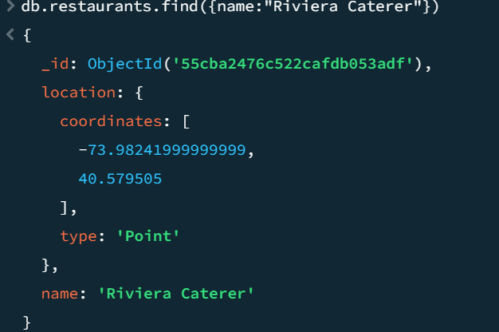
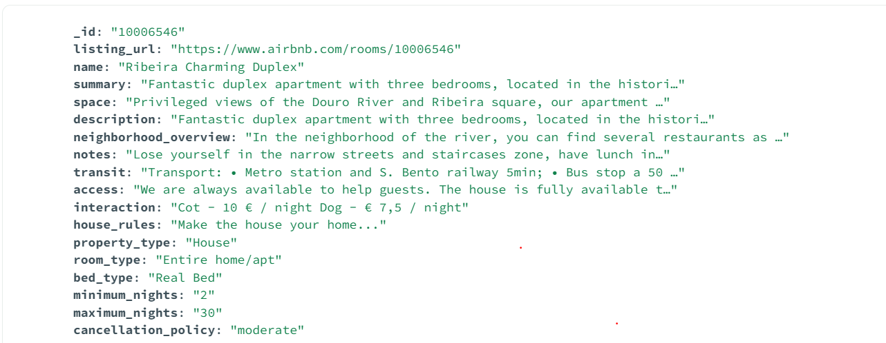

# MongoDB

#### Exobook

###### Créer une base de donnée :

`use sample_db;`

###### Créer une collection :

`db.createCollection("employees");`

###### Inserer des donnée dans une collection :

`db.employees.insert({ name: "John Doe", age: 35, job: "Manager", salary: 80000 });`

`db.employees.insert({ name: "Jane Doe", age: 32, job: "Developer", salary: 75000 });`

`db.employees.insert({ name: "Jim Smith", age: 40, job: "Manager", salary: 85000 });`

###### Trouver tous les documents dans la collection "employees" :

`db.employees.find({});`

###### Trouver tous les documents où l'âge est supérieur à 33 :

`db.employees.find({ age: { $gt: 33 } });`

###### Trier les documents dans la collection "employees" par salaire décroissant :

`db.employees.find({}).sort({ salary: -1 });`

###### Requête pour sélectionner uniquement le nom et le job de chaque document :

`db.employees.find({}, { name: true, job: true, _id: false });`

###### Requête pour compter le nombre d'employés par poste :

`db.employees.aggregate([{ $group: { _id: "$job", count: { $sum: 1 } } }]);`

###### Requête pour mettre à jour le salaire de tous les développeurs à 80000 :

`db.employees.updateMany({ job: "Developer" }, { $set: { salary: 80000 }});`

#### Exo

###### Exercice 1
`db.salles.find({smac:true}, {nom:true});`

###### Exercice 2
`db.salles.find({capacite:{$gt:1000}}, {nom:true,_id:false});`

###### Exercice 3
`db.salles.find({"adresse.numero": {$exists: false}}, {_id: true})`

###### Exercice 4
`db.salles.find({avis: {$size: 1}}, {nom: true})`

###### Exercice 5
`db.salles.find({styles: "blues"}, {styles: true, _id: false})`

###### Exercice 6
`db.salles.find({"styles.0": "blues"}, {styles: true, _id: false})`

###### Exercice 7
`db.salles.find({$and: [{"adresse.codePostal": /^84/}, {capacite: {$lt: 500}}]}, {"adresse.ville": true,_id:false})`

###### Exercice 8
`db.salles.find({$or: [{_id: {$mod: [2, 0]}}, {avis: {$exists: false}}]}, {_id: true})`

###### Exercice 9
`db.salles.find({"avis.note":{$gte:8,$lte:10}}, {nom:true, _id: false})`

###### Exercice 10
`db.salles.find({"avis.date":{$gte: new Date('2019-11-15')}}, {nom:true, _id: false})`

###### Exercice 11
`db.salles.find({$expr: {$gt: [{$multiply: ["$_id", 100]}, "$capacite"]}},{nom:true,capacite:true, _id: false})`

###### Exercice 12
`db.salles.aggregate([{$match:{smac:true}},{$project:{_id:false,nom:true,stylesCount:{$size:"$styles"}}},{$match:{stylesCount:{$gte:2}}}])`

###### Exercice 13
`db.salles.distinct("adresse.codePostal")`

###### Exercice 14
`db.salles.updateMany({},{$inc{capacite:100}})`

###### Exercice 15
`db.salles.updateMany({styles: {$ne: "jazz"}}, {$push: {styles: "jazz"}})`

###### Exercice 16
`db.salles.updateMany({_id: {$nin: [2,3]}}, {$pull: {styles: "funk"}})`

###### Exercice 17
`db.salles.updateOne({_id: 3}, {$addToSet: {styles: {$each: ["techno", "reggae"]}}})`

###### Exercice 18
`db.salles.updateMany({nom: /^P/i}, {$inc: {capacite: 150}, $push: {contact: {telephone: "04 11 94 00 10"}}})`

###### Exercice 19
`db.salles.updateMany({nom:/\b[aeiouyAEIOUY]/}, {$push: {avis:{date: new Date(), note:10}}})`

###### Exercice 20
`db.salles.updateMany({nom:/^z/i},{$set: {nom: "Pub Z", capacite: 50, smac: false}}, {upsert: true})`

###### Exercice 21
`db.salles.countDocuments({_id: {$type: "objectId"}})`

###### Exercice 22
`db.salles.find({_id: {$not: {$type: "objectId"}}}, {nom: true, _id:false}).sort({capacite: -1}).limit(1)`

###### Exercice 23
`db.salles.replaceOne({"_id":ObjectId("65b7d0cd903afdd9af73f279")}, {nom: "Pub Z", capacite: 60})`
`db.salles.replaceOne({"_id":ObjectId("65b7d0cd903afdd9af73f279")}, {nom: ObjectId("65b7d0cd903afdd9af73f279").nom, capacite: 60})`

###### Exercice 24
`db.salles.deleteOne({_id: {$type: "objectId"}, capacite: {$lte: 60}})`

###### Exercice 25
`db.salles.findOneAndUpdate({"adresse.ville": "Nîmes"}, {$inc: {capacite: -15}})`


#### Db Restaurants

Récupérez la liste des restaurants ayant un grade inférieur à un score de 10 (Afficher cette liste sous forme de projection {name, grades.scores}) 
`db.restaurantscollection.find({"grades.score":{$lt: 10}},{name:true,"grades.score":true})`

#### Geo

Exo 1:

```js
var KilometresEnRadians = function(kilometres){ var rayonTerrestreEnKm = 6371;
return kilometres / rayonTerrestreEnKm;};
var salle = db.salles.findOne({"adresse.ville": "Nîmes"});
var requete = { "adresse.localisation": { $nearSphere: { $geometry: {type : "Point",
coordinates : [salle.adresse.localisation.coordinates[0], salle.adresse.localisation.coordinates[1]]}, $maxDistance: KilometresEnRadians(60) } }, styles: { $all: ["blues", "soul"] } };
db.salles.find(requete, {nom: true, _id: false});

//correction :
var KilometresEnRadians = function(kilometres){ var rayonTerrestreEnKm = 6371;
return kilometres / rayonTerrestreEnKm;};
var salle = db.salles.findOne({"adresse.ville": "Nîmes"});

var requete = { "adresse.localisation":{
  $geoWithin:{$centerSphere:[
    salle.adresse.localisation.coordinates,
    KilometresEnRadians(60)]
    }
    }, styles: { $in: ["blues", "soul"]}};
db.salles.find(requete, {nom: true, _id: false});

```

Exo 2:
```js
var marseille = {"type": "Point", "coordinates": [43.300000, 5.400000]}
db.salles.find({"adresse.localisation": {$nearSphere: {$geometry: marseille, $maxDistance: 100000}}}, {"adresse.ville": true, _id: false}).sort({"adresse.localisation": 1})
```

Exo 3:
```js
var polygone = {
  type: "Polygon",
  coordinates: [
    [
      [43.94899, 4.80908],
      [43.95292, 4.80929],
      [43.95174, 4.8056],
      [43.94899, 4.80908],
    ],
  ],
};
 
db.salles.find({"adresse.localisation": {$geoWithin: {$geometry: polygone}}}, {nom: true, _id: false})
//correction :
db.salles.find({"adresse.localisation": {$geoIntersects: {$geometry: polygone}}}, {nom: true, _id: false})
```

Exo suite suite :

Import :
`mongoimport /data/restaurants.json -d test -c restaurants`

Index :
```js
db.restaurants.createIndex({location:"2dsphere"})
db.neighborhoods.createIndex({geometry:"2dsphere"})
```

Trouvez la commande qui va retourner le restaurant Riviera Caterer... De quel type d'ojet GeoJSON s'agit-il ?

`db.restaurants.find({name:"Riviera Caterer"})`

Il est de type Point

Trouvez "Hell's kitchen" au sein de la collection "neighborhoods" et retournez le nom du quartier, sa superficie et sa population. Quelle est la superficie totale de ce quartier ?
```js
var Hell=db.restaurants.find({name:"Hell'S Kitchen"})
db.neighborhoods.find({Hell: {$geoWithin: {$geometry: {type:"Polygon",coordinates: "geometry.coordinates"}}}})

//Trouvez la requete type qui permet de recuperer le nom du quartier a partir d'un point donné.

db.neighborhoods.find({
  geometry:{
    $geoIntersects:{
      $geometry:{
        type:"Point",
        coordinates:[0,0]
      }
    }
  }
},{name:1,_id:0})

//Trouver la requete qui trouve les restaurants dans un rayon donné (8km par exemple)

db.restaurants.find(
  {
    location:{$geoWithin:
    {$centerSphere}}

})
```


Text_Search:

Exercice:
importez le jeu d'essai, decrivez le:



creer un index de text sur les champs summary, description et name:

`db.Reviews.createIndex({ name: "text", description: "text", summary:"text" });`

Lister tous les appartements contenant le terme duplex

`db.stReviewsores.find({ $text: { $search: "duplex" } },{name:true})`

Compter le nombre d'appartements qui possède un lit king size

`db.Reviews.countDocuments({$text: { $search: '"king size"'}})` = 126

Compter combien d'appartements ont pour description cozy, studio mais pas furnish (a partir de cette etape supprimez l'index et le placer uniquement sur la description)

`db.Reviews.dropIndex("name_index");`

`db.Reviews.createIndex({ description: "text"});`

`db.Reviews.countDocuments({$text:{ $search:"cozy studio -furnish"}})` = 783

